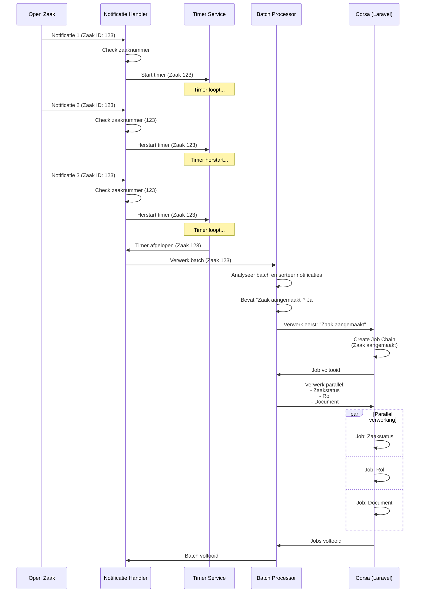

# Verwerking notificaties open zaak naar Corsa

## Volgordelijkheid van berichten
Omdat notificaties in onvoorspelbare volgorde binnenkomen, én verwerking tijd kost, moeten notificaties (soms) in een specifieke volgorde worden verwerkt.
Daarnaast is het zo dat onvoorspelbaar is welke notificaties binnenkomen en binnen moeten zijn voor een taak gestart kan worden. Daarom verwerken we
notificaties als volgt:
- Bij elke notificatie die binnenkomt checken we het zaaknummer
- Voor elk zaaknummer starten we bij een binnengekomen notificatie een timer
- Als een nieuwe notificatie binnenkomt voor die zaak terwijl de timer loopt herstarten we de timer
- Als de timer afloopt starten we verwerking van de notificaties, op een logische volgorde

Voor het bepalen van de volgorde hanteren we de volgende types notificaties die we willen verwerken:
- Zaak aangemaakt
- Zaakstatus aan zaak toegevoegd
- Rol aan zaak toegevoegd
- Document aan zaak toegevoegd

De 'zaak aangemaakt' notificatie moet altijd als eerste worden verwerkt. Andere notificaties kunnen daarna parallel worden verwerkt. Als in een 
notificatiebatch (gedefinieerd als de set notificaties die binnen een timer-periode binnen zijn) géén zaak aangemaakt zit kunnen de notificaties parallel
worden verwerkt, anders moet eerst de 'zaak aangemaakt'-notificatie worden afgehandeld.

## Afhandeling
Van elke batch wordt een 'job chain' gedefinieerd in de applicatie (Laravel). 

## Timer Reset Mechanisme

```mermaid
gantt
    title Timer Reset bij Notificaties (Zaak 123)
    dateFormat ss
    axisFormat %S sec
    
    section Notificaties
    Notificatie 1 ontvangen    :milestone, n1, 00, 0s
    Notificatie 2 ontvangen    :milestone, n2, 03, 0s
    Notificatie 3 ontvangen    :milestone, n3, 07, 0s
    
    section Timer
    Timer 1 (5 sec)            :t1, 00, 5s
    Timer 2 (5 sec)            :t2, 03, 5s
    Timer 3 (5 sec)            :t3, 07, 5s
    
    section Verwerking
    Batch verwerking start     :milestone, process, 12, 0s
    Batch verwerking           :active, 12, 3s
```

