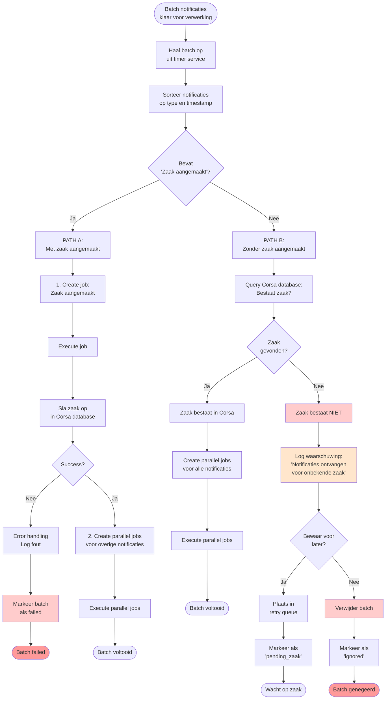

User: Werk onderstaande beschrijving uit als een sequence diagram, en eventueel visueel op een zinnige manier:
Verwerking notificaties open zaak naar Corsa
Volgordelijkheid van berichten
Omdat notificaties in onvoorspelbare volgorde binnenkomen, én verwerking tijd kost, moeten notificaties (soms) in een specifieke volgorde worden verwerkt.
Daarnaast is het zo dat onvoorspelbaar is welke notificaties binnenkomen en binnen moeten zijn voor een taak gestart kan worden. Daarom verwerken we
notificaties als volgt:
Bij elke notificatie die binnenkomt checken we het zaaknummer
Voor elk zaaknummer starten we bij een binnengekomen notificatie een timer
Als een nieuwe notificatie binnenkomt voor die zaak terwijl de timer loopt herstarten we de timer
Als de timer afloopt starten we verwerking van de notificaties, op een logische volgorde
 Voor het bepalen van de volgorde hanteren we de volgende types notificaties die we willen verwerken:
Zaak aangemaakt
Zaakstatus aan zaak toegevoegd
Rol aan zaak toegevoegd
Document aan zaak toegevoegd
 De 'zaak aangemaakt' notificatie moet altijd als eerste worden verwerkt. Andere notificaties kunnen daarna parallel worden verwerkt. Als in een
notificatiebatch (gedefinieerd als de set notificaties die binnen een timer-periode binnen zijn) géén zaak aangemaakt zit kunnen de notificaties parallel
worden verwerkt, anders moet eerst de 'zaak aangemaakt'-notificatie worden afgehandeld.
Afhandeling
Van elke batch wordt een 'job chain' gedefinieerd in de applicatie (Laravel).
Model: # Sequence Diagram: Verwerking Notificaties Open Zaak naar Corsa

Ik zal dit uitwerken in zowel een sequence diagram als een visueel overzicht van de verschillende scenario's.

## 1. Sequence Diagram

```
┌─────────────┐  ┌──────────────┐  ┌─────────────┐  ┌──────────────┐  ┌─────────────┐
│  Open Zaak  │  │  Notificatie │  │   Timer     │  │    Batch     │  │   Corsa     │
│             │  │   Handler    │  │   Service   │  │  Processor   │  │  (Laravel)  │
└──────┬──────┘  └──────┬───────┘  └──────┬──────┘  └──────┬───────┘  └──────┬──────┘
       │                │                 │                │                 │
       │ Notificatie 1  │                 │                │                 │
       │ (Zaak ID: 123) │                 │                │                 │
       ├───────────────>│                 │                │                 │
       │                │                 │                │                 │
       │                │ Check zaak-     │                │                 │
       │                │ nummer          │                │                 │
       │                ├─────────┐       │                │                 │
       │                │         │       │                │                 │
       │                │<────────┘       │                │                 │
       │                │                 │                │                 │
       │                │ Start timer     │                │                 │
       │                │ (Zaak 123)      │                │                 │
       │                ├────────────────>│                │                 │
       │                │                 │                │                 │
       │                │            Timer loopt...        │                 │
       │                │                 │                │                 │
       │ Notificatie 2  │                 │                │                 │
       │ (Zaak ID: 123) │                 │                │                 │
       ├───────────────>│                 │                │                 │
       │                │                 │                │                 │
       │                │ Check zaak-     │                │                 │
       │                │ nummer (123)    │                │                 │
       │                ├─────────┐       │                │                 │
       │                │         │       │                │                 │
       │                │<────────┘       │                │                 │
       │                │                 │                │                 │
       │                │ Herstart timer  │                │                 │
       │                │ (Zaak 123)      │                │                 │
       │                ├────────────────>│                │                 │
       │                │                 │                │                 │
       │ Notificatie 3  │                 │                │                 │
       │ (Zaak ID: 123) │                 │                │                 │
       ├───────────────>│                 │                │                 │
       │                │                 │                │                 │
       │                │ Check zaak-     │                │                 │
       │                │ nummer (123)    │                │                 │
       │                ├─────────┐       │                │                 │
       │                │         │       │                │                 │
       │                │<────────┘       │                │                 │
       │                │                 │                │                 │
       │                │ Herstart timer  │                │                 │
       │                │ (Zaak 123)      │                │                 │
       │                ├────────────────>│                │                 │
       │                │                 │                │                 │
       │                │            Timer loopt...        │                 │
       │                │                 │                │                 │
       │                │                 │ Timer afgelopen│                 │
       │                │                 │ (Zaak 123)     │                 │
       │                │<────────────────┤                │                 │
       │                │                 │                │                 │
       │                │ Verwerk batch   │                │                 │
       │                │ (Zaak 123)      │                │                 │
       │                ├────────────────────────────────>│                 │
       │                │                 │                │                 │
       │                │                 │    Analyseer batch               │
       │                │                 │    en sorteer notificaties       │
       │                │                 │                ├─────────┐       │
       │                │                 │                │         │       │
       │                │                 │                │<────────┘       │
       │                │                 │                │                 │
       │                │                 │    Bevat "Zaak aangemaakt"?     │
       │                │                 │                ├─────────┐       │
       │                │                 │                │   Ja    │       │
       │                │                 │                │<────────┘       │
       │                │                 │                │                 │
       │                │                 │    Verwerk eerst:               │
       │                │                 │    "Zaak aangemaakt"            │
       │                │                 │                ├────────────────>│
       │                │                 │                │                 │
       │                │                 │                │ Create Job Chain│
       │                │                 │                │ (Zaak aangemaakt)
       │                │                 │                │                 ├───┐
       │                │                 │                │                 │   │
       │                │                 │                │                 │<──┘
       │                │                 │                │                 │
       │                │                 │                │   Job voltooid  │
       │                │                 │                │<────────────────┤
       │                │                 │                │                 │
       │                │                 │    Verwerk parallel:            │
       │                │                 │    - Zaakstatus                 │
       │                │                 │    - Rol                        │
       │                │                 │    - Document                   │
       │                │                 │                ├────────────────>│
       │                │                 │                │                 │
       │                │                 │                │ Create Job Chain│
       │                │                 │                │ (parallel jobs) │
       │                │                 │                │                 ├───┐
       │                │                 │                │                 │   │
       │                │                 │                │  ┌──────────┐  │   │
       │                │                 │                │  │Zaakstatus│  │   │
       │                │                 │                │  └──────────┘  │   │
       │                │                 │                │  ┌──────────┐  │   │
       │                │                 │                │  │   Rol    │  │   │
       │                │                 │                │  └──────────┘  │   │
       │                │                 │                │  ┌──────────┐  │   │
       │                │                 │                │  │ Document │  │   │
       │                │                 │                │  └──────────┘  │<──┘
       │                │                 │                │                 │
       │                │                 │                │  Jobs voltooid  │
       │                │                 │                │<────────────────┤
       │                │                 │                │                 │
       │                │                 │    Batch voltooid               │
       │                │<────────────────────────────────┤                 │
       │                │                 │                │                 │
```

## 2. Visueel Overzicht: Scenario's

### **Scenario A: Batch MET "Zaak aangemaakt"**

```
┌─────────────────────────────────────────────────────────────────┐
│                    TIMER PERIODE (Zaak 123)                     │
│                                                                  │
│  Notificatie 1  →  Notificatie 2  →  Notificatie 3  →  ...     │
│  (Zaak Status)     (Rol)             (Zaak aangemaakt)          │
│        ↓               ↓                    ↓                    │
│        └───────────────┴────────────────────┘                   │
│                         │                                        │
└─────────────────────────┼────────────────────────────────────────┘
                          ↓
              ┌───────────────────────┐
              │   BATCH PROCESSOR     │
              │   Sorteer op type     │
              └───────────┬───────────┘
                          ↓
              ┌───────────────────────┐
              │   VOLGORDE BEPALING   │
              └───────────┬───────────┘
                          ↓
         ┌────────────────────────────────────┐
         │                                    │
         ↓                                    ↓
    ┌─────────┐                    ┌──────────────────────┐
    │  STAP 1 │                    │       STAP 2         │
    │ (Eerst) │                    │     (Parallel)       │
    └────┬────┘                    └──────────┬───────────┘
         │                                    │
         ↓                                    ↓
┌─────────────────┐              ┌───────────────────────────┐
│ Zaak aangemaakt │              │  ┌─────────────────────┐  │
└─────────────────┘              │  │   Zaakstatus        │  │
                                 │  └─────────────────────┘  │
                                 │  ┌─────────────────────┐  │
                                 │  │   Rol               │  │
                                 │  └─────────────────────┘  │
                                 │  ┌─────────────────────┐  │
                                 │  │   Document          │  │
                                 │  └─────────────────────┘  │
                                 └───────────────────────────┘
```

### **Scenario B: Batch ZONDER "Zaak aangemaakt"**

```
┌─────────────────────────────────────────────────────────────────┐
│                    TIMER PERIODE (Zaak 456)                     │
│                                                                  │
│  Notificatie 1  →  Notificatie 2  →  Notificatie 3  →  ...     │
│  (Zaak Status)     (Rol)             (Document)                 │
│        ↓               ↓                    ↓                    │
│        └───────────────┴────────────────────┘                   │
│                         │                                        │
└─────────────────────────┼────────────────────────────────────────┘
                          ↓
              ┌───────────────────────┐
              │   BATCH PROCESSOR     │
              │   Sorteer op type     │
              └───────────┬───────────┘
                          ↓
              ┌───────────────────────┐
              │   VOLGORDE BEPALING   │
              │  Geen "Zaak           │
              │   aangemaakt"         │
              └───────────┬───────────┘
                          ↓
              ┌───────────────────────┐
              │    ALLES PARALLEL     │
              └───────────┬───────────┘
                          ↓
         ┌────────────────┼───────────────────┐
         │                │                   │
         ↓                ↓                   ↓
  ┌─────────────┐  ┌─────────────┐  ┌─────────────┐
  │ Zaakstatus  │  │     Rol     │  │  Document   │
  └─────────────┘  └─────────────┘  └─────────────┘
```

## 3. Timer Mechanisme Visueel

```
Tijdlijn →

Notif 1        Notif 2           Notif 3              Timer
  ↓              ↓                 ↓                   afgelopen
  │              │                 │                      │
  ├──────────────┼─────────────────┼──────────────────────┤
  │              │                 │                      │
  │◄─── T ──────►│                 │                      │
  │              │◄──── T ────────►│                      │
  │              │                 │◄──────── T ─────────►│
  │              │                 │                      │
  │              │                 │                      ↓
  │              │                 │              ┌───────────────┐
  │              │                 │              │   Verwerk     │
  │              │                 │              │   Batch       │
  │              │                 │              └───────────────┘

T = Timer periode (bijv. 5 seconden)
Bij elke nieuwe notificatie: timer reset
```

## 4. State Diagram: Notificatie Verwerking

```
                    ┌──────────────────┐
                    │   Notificatie    │
                    │   Ontvangen      │
                    └────────┬─────────┘
                             │
                             ↓
                    ┌──────────────────┐
                    │  Check Zaak-     │
                    │  nummer          │
                    └────────┬─────────┘
                             │
                ┌────────────┴────────────┐
                │                         │
                ↓                         ↓
      ┌──────────────────┐      ┌──────────────────┐
      │  Timer loopt     │      │  Start nieuwe    │
      │  al voor zaak    │      │  timer           │
      └────────┬─────────┘      └────────┬─────────┘
               │                         │
               ↓                         │
      ┌──────────────────┐              │
      │  Herstart        │              │
      │  timer           │              │
      └────────┬─────────┘              │
               │                         │
               └────────────┬────────────┘
                            │
                            ↓
                   ┌──────────────────┐
                   │  Wacht op timer  │
                   │  afloop          │
                   └────────┬─────────┘
                            │
                            ↓
                   ┌──────────────────┐
                   │  Timer           │
                   │  afgelopen       │
                   └────────┬─────────┘
                            │
                            ↓
                   ┌──────────────────┐
                   │  Analyseer       │
                   │  batch           │
                   └────────┬─────────┘
                            │
                ┌───────────┴───────────┐
                │                       │
                ↓                       ↓
      ┌──────────────────┐    ┌──────────────────┐
      │  Bevat "Zaak     │    │  Bevat GEEN      │
      │  aangemaakt"     │    │  "Zaak           │
      │                  │    │  aangemaakt"     │
      └────────┬─────────┘    └────────┬─────────┘
               │                       │
               ↓                       ↓
      ┌──────────────────┐    ┌──────────────────┐
      │  Sequentieel +   │    │  Alles parallel  │
      │  dan parallel    │    │                  │
      └────────┬─────────┘    └────────┬─────────┘
               │                       │
               └───────────┬───────────┘
                           │
                           ↓
                  ┌──────────────────┐
                  │  Maak Job Chain  │
                  │  in Laravel      │
                  └────────┬─────────┘
                           │
                           ↓
                  ┌──────────────────┐
                  │  Verwerking      │
                  │  voltooid        │
                  └──────────────────┘
```

## 5. Job Chain Structuur (Laravel)

```
┌─────────────────────────────────────────────────────────────┐
│                     JOB CHAIN (Laravel)                     │
├─────────────────────────────────────────────────────────────┤
│                                                              │
│  IF (batch bevat "Zaak aangemaakt"):                       │
│                                                              │
│    ┌──────────────────────────────────────────────┐        │
│    │  Job 1: ProcessZaakAangemaaktNotification    │        │
│    │  Priority: HIGH                              │        │
│    │  Status: MUST_COMPLETE_FIRST                 │        │
│    └────────────────┬─────────────────────────────┘        │
│                     │                                       │
│                     ↓ (wait for completion)                │
│                     │                                       │
│    ┌────────────────┴─────────────────────────────┐        │
│    │         PARALLEL JOBS (Batch)                │        │
│    │                                               │        │
│    │  ┌─────────────────────────────────────┐    │        │
│    │  │ Job 2a: ProcessZaakstatusNotif     │    │        │
│    │  └─────────────────────────────────────┘    │        │
│    │                                               │        │
│    │  ┌─────────────────────────────────────┐    │        │
│    │  │ Job 2b: ProcessRolNotification      │    │        │
│    │  └─────────────────────────────────────┘    │        │
│    │                                               │        │
│    │  ┌─────────────────────────────────────┐    │        │
│    │  │ Job 2c: ProcessDocumentNotification │    │        │
│    │  └─────────────────────────────────────┘    │        │
│    │                                               │        │
│    └───────────────────────────────────────────────┘        │
│                                                              │
│  ELSE (geen "Zaak aangemaakt"):                            │
│                                                              │
│    ┌───────────────────────────────────────────────┐       │
│    │         ALLE JOBS PARALLEL                    │       │
│    │                                                │       │
│    │  ┌─────────────────────────────────────┐     │       │
│    │  │ Job 1: ProcessZaakstatusNotif      │     │       │
│    │  └─────────────────────────────────────┘     │       │
│    │                                                │       │
│    │  ┌─────────────────────────────────────┐     │       │
│    │  │ Job 2: ProcessRolNotification       │     │       │
│    │  └─────────────────────────────────────┘     │       │
│    │                                                │       │
│    │  ┌─────────────────────────────────────┐     │       │
│    │  │ Job 3: ProcessDocumentNotification  │     │       │
│    │  └─────────────────────────────────────┘     │       │
│    │                                                │       │
│    └────────────────────────────────────────────────┘       │
│                                                              │
└─────────────────────────────────────────────────────────────┘
```

## 6. Data Model: Notificatie Batch

```
┌────────────────────────────────────────┐
│       NotificationBatch                │
├────────────────────────────────────────┤
│ - zaak_id: string                      │
│ - created_at: timestamp                │
│ - timer_started_at: timestamp          │
│ - timer_expires_at: timestamp          │
│ - status: enum (pending/processing)    │
│ - notifications: array                 │
└─────────────────┬──────────────────────┘
                  │
                  │ has many
                  │
                  ↓
┌────────────────────────────────────────┐
│       Notification                     │
├────────────────────────────────────────┤
│ - id: int                              │
│ - batch_id: int                        │
│ - type: enum                           │
│   ├─ zaak_aangemaakt                   │
│   ├─ zaakstatus_toegevoegd             │
│   ├─ rol_toegevoegd                    │
│   └─ document_toegevoegd               │
│ - payload: json                        │
│ - received_at: timestamp               │
│ - processed: boolean                   │
│ - processing_order: int                │
└────────────────────────────────────────┘
```

Deze uitwerking geeft een volledig beeld van het notificatie-verwerkingsproces met alle belangrijke aspecten: timing, volgordelijkheid, en de specifieke handling van verschillende scenario's.
User: Pas de diagrammen aan zodat ze in mermaid syntax staan
Model: # Sequence Diagram: Verwerking Notificaties Open Zaak naar Corsa (Mermaid)

## 1. Sequence Diagram - Hoofdproces


## 2. Sequence Diagram - Scenario ZONDER "Zaak aangemaakt"


## 3. State Diagram - Notificatie Verwerking


## 4. Flowchart - Batch Verwerking Logica


## 5. Flowchart - Timer Mechanisme


## 6. Class Diagram - Data Model


## 7. Architecture Diagram - Component Overview


## 8. Timing Diagram - Timer Reset Mechanisme


## 9. Decision Tree - Verwerkingsvolgorde


## 10. Swimlane Diagram - Verantwoordelijkheden


Deze Mermaid diagrammen kunnen direct in Markdown documenten, GitLab, GitHub, Notion en andere tools worden gebruikt die Mermaid ondersteunen!
User: Voeg hier een keuze in toe: Als een zaak aangemaakt notificatie bestaat, verwerk zoals hier beschreven, als er geen zaak gemaakt notificatie is, controleer in corsa of de zaak bestaat, en verwerk alleen als dat zo is:

Model: Hier is het aangepaste sequence diagram met de toegevoegde logica:


## Bijbehorende Flowchart met de nieuwe logica


## State Diagram met nieuwe logica


## Decision Tree - Uitgebreide verwerkingslogica


## Uitgebreide Flowchart met alle scenario's



## Class Diagram met uitgebreide logica


Deze diagrammen tonen nu duidelijk de keuzelogica waarbij:
1. **Met "Zaak aangemaakt"**: Direct verwerken zoals eerder beschreven
2. **Zonder "Zaak aangemaakt"**: Eerst controleren of de zaak bestaat in Corsa, en alleen verwerken als dat zo is, anders negeren of bewaren voor later
